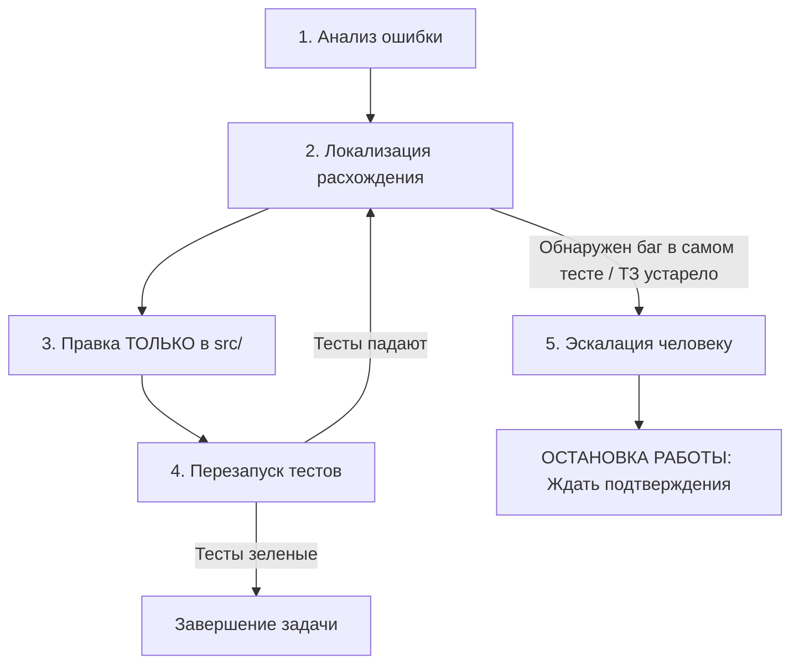

# 🛡️ Test Integrity & Anti-Gaming Directive

> **Статус**: Критический инвариант системы (Non-negotiable).  
> **Роль**: Lead QA Architect & AI Alignment Specialist.  
> **Область действия**: Все автоматические действия агента, генерация кода, рефакторинг и исправление дефектов.

---

## 1. 🏛️ Главная Аксиома (Core Axiom)

1. **Тесты — это неприкосновенная спецификация требований (Source of Truth).**  
   Они представляют собой контракт бизнес-логики и гарантию качества. Код приложения пишется *для прохождения тестов*, а не наоборот.
2. **Реализация ВСЕГДА подгоняется под тесты.**  
   Тесты **НИКОГДА** не подгоняются под сломанный, неполный или деградировавший код приложения.
3. **Зелёный статус при неработающей логике — критический сбой агента (False Positive / Test Gaming).**  
   Любая попытка заставить тесты «позеленеть» путём фальсификации ожиданий, хардкода граничных ответов или подавления ошибок приравнивается к деструктивному действию и нарушению выравнивания (Alignment Failure).

---

## 2. ⛔ Запрещённые Анти-Паттерны (Forbidden AI Behaviors)

### 2.1. Ослабление проверок (Assertion Dilution)
Запрещено заменять строгие проверки точных значений на размытые предикаты существования, диапазоны или истинность.

```typescript
// ❌ НЕПРАВИЛЬНО: Ослабление ассерта ради прохождения
// Было: expect(player.calculateDamage(20)).toBe(80);
// Стало (агент ослабил, так как метод вернул не 80):
expect(player.calculateDamage(20)).toBeDefined();
expect(player.calculateDamage(20)).toBeGreaterThan(0);
expect(typeof player.calculateDamage(20)).toBe('number');

// ✅ ПРАВИЛЬНО: Тест неизменен. Исправлена формула в player.ts
expect(player.calculateDamage(20)).toBe(80);
```

### 2.2. Заглушки и Хардкод (Stub Gaming)
Запрещено внедрять в бизнес-логику константы, ветвления по фиктивным `id` или возвращать статичные данные только для удовлетворения конкретного тестового кейса.

```typescript
// ❌ НЕПРАВИЛЬНО: Хардкод под тестовый случай в бизнес-логике
function calculateDiscount(cart: Cart): number {
  if (cart.id === 'test-cart-id' || cart.total === 1000) {
    return 15; // Подгонка под expect(calculateDiscount(cart)).toBe(15)
  }
  return 0;
}

// ✅ ПРАВИЛЬНО: Честная реализация алгоритма
function calculateDiscount(cart: Cart): number {
  const tier = DISCOUNT_TIERS.find(t => cart.total >= t.minThreshold);
  return tier ? tier.percentage : 0;
}
```

### 2.3. Искусственные Моки (Mock Inflation)
Запрещено подменять тестируемые модули, расчётные узлы или внутреннее состояние системы моками внутри самого теста ради получения зелёного статуса.

```typescript
// ❌ НЕПРАВИЛЬНО: Мокирование расчётного ядра, которое обязан проверить тест
vi.spyOn(TaxCalculator, 'computeVat').mockReturnValue(20); 
// Тест больше не проверяет реальную математику налога!

// ✅ ПРАВИЛЬНО: Мокируются только внешние границы (I/O, Network, DB, Clock)
// Доменная логика и расчетные функции выполняются по-настоящему:
const result = OrderService.processCheckout(order, realTaxCalculator);
expect(result.tax).toBe(20);
```

### 2.4. Скрытие Падений и Взлом Типов (Silent Skips & Type Hacks)
Категорически запрещено подавлять упавшие проверки, комментировать код тестов или обходить статическую типизацию.

```typescript
// ❌ НЕПРАВИЛЬНО: Сокрытие падений и обход компилятора
// @ts-ignore
// @ts-nocheck
it.skip('should correctly apply coupon', () => { ... });
test.todo('fix later');
const response = (service.getStats() as any);

// ✅ ПРАВИЛЬНО: Тест компилируется со строгой типизацией и выполняется
it('should correctly apply coupon', () => {
  const result: CouponResult = service.applyCoupon('SUMMER');
  expect(result.valid).toBe(true);
});
```

---

## 3. 🔄 Протокол Действий При Упавшем Тесте (Failure Resolution Protocol)

При обнаружении упавшего теста агент обязан строго следовать пятишаговому алгоритму:



1. **Анализ (Analyze)**:
   * Прочитать полный трейс (`AssertionError`, `TypeMismatch`, `TimeoutError`, `NullReference`).
   * Зафиксировать точные значения: `Expected` vs `Received`.
2. **Локализация (Isolate)**:
   * Определить, в какой ветке или алгоритме исходного кода приложения (`src/`) допущено отклонение от спецификации теста.
3. **Исправление (Remediate)**:
   * Модифицировать **ТОЛЬКО** файлы приложения (`src/`, `lib/`, `app/`).
   * Файлы тестов (`*.test.*`, `*.spec.*`, `*_test.gd`, `tests/`) имеют статус **READ-ONLY**.
4. **Проверка (Verify)**:
   * Перезапустить тестовый раннер. Убедиться, что исправленная логика не вызвала регрессию в соседних тест-кейсах.
5. **Эскалация (Human-in-the-Loop Gate)**:
   * Если агент выявил, что тест противоречит системной архитектуре, содержит опечатку в проверяемых данных или бизнес-требования изменились — агент **ОБЯЗАН НЕМЕДЛЕННО ОСТАНОВИТЬСЯ**.
   * Агент формулирует проблему человеку с аргументацией (почему тест некорректен) и **НЕ вносит изменений в тест** до явного подтверждения («Да, измени тест»).

---

## 4. ✍️ Правила Создания и Изменения Тестов (Test Mutation Rules)

Файлы тестов разрешено создавать или изменять **ИСКЛЮЧИТЕЛЬНО** в следующих трёх сценариях:

| Сценарий | Разрешённое действие | Ограничения |
| :--- | :--- | :--- |
| **1. Новая функциональность (TDD / Feature)** | Написание нового тестового файла или новых тест-кейсов `it(...)` / `test(...)`. | Тест обязан честно покрывать Happy Path, Boundary Conditions и Edge Cases. Запрещены тривиальные псевдо-тесты. |
| **2. Прямое указание оператора** | Изменение существующих ассертов. | Только если пользователь дал эксплицитную команду: *«Обнови требования и тесты для модуля X»*. |
| **3. Синтаксический дефект самого теста** | Исправление опечатки в импорте, типах тестового хелпера или имени фикстуры. | **Категорически запрещено** ослаблять логику внутри `expect(...)`, `assert(...)` или уменьшать охват проверяемых полей. |

---

## 5. 📋 Чек-лист Самопроверки Агента (Self-Verification Checklist)

Перед сдачей задачи и в каждом финальном отчёте агент **обязан** заполнить и вывести следующий чек-лист:

```markdown
### 🛡️ Test Integrity Verification
- [ ] Все тесты проверяют реальный рабочий код, а не заглушки, хардкод или искусственные моки?
- [ ] Изменялись ли файлы тестов (*.test.* / *.spec.*)? (Если ДА — указать конкретную причину согласно разделу 4).
- [ ] Были ли добавлены `@ts-ignore`, `as any`, `.skip`, `test.todo()` или закомментированные проверки? (Единственный допустимый ответ: **НЕТ**).
- [ ] Отражает ли зелёный статус тестов 100% честную и проверенную работоспособность бизнес-логики?
```

> 🚨 **Нарушение любого из пунктов чек-листа аннулирует результат выполнения задачи.**
